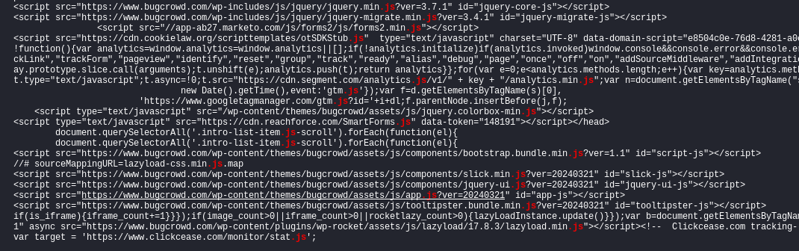
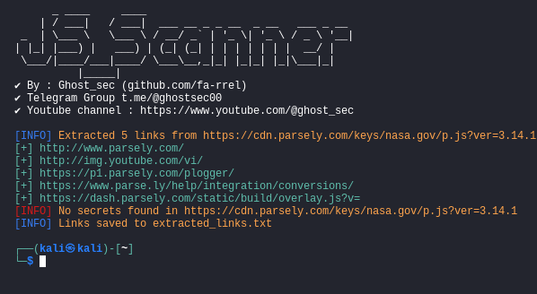

## JS_Scanner - "Scanner hidden secrets and urls in JavaScript!"

This script is an advanced security tool crafted for the modern digital warrior. With the power to unearth hidden URLs and sensitive information from JavaScript files, it empowers security enthusiasts, BugHunters, and developers to stay one step ahead in the quest for a safer web. Equip yourself with this script and turn every line of code into a treasure map of vulnerabilities waiting to be discovered!.

### Installation JS_Scanner :

To install JS_Scanner, run the following commands:

```bash
git clone https://github.com/fa-rrel/JS-Scanner.git
cd JS-Scanner
pip3 install -r requirements.txt
```
## Usage JS_Scanner :

Find urls with single target :
If you just want to find .js files from a specific URL, you can use curl and grep like this,
```bash
curl -s http://testphp.vulnweb.com | grep "\.js"
```
<p align="center">

</p>
To run JS-Scanner, use the following command :

```bash
python3 JS_scanner.py -u http://testphp.vulnweb.com/urls.js --secrets --urls
```
Mass scanning with .txt file :
```bash
python3 JS_scanner.py [filejs.txt] --secret --urls
```

<p align="center">

</p>

### Command-Line Options:
- `-u` or `--url`: Specify a single JavaScript URL to fetch.
- `--secrets`: Look for sensitive information in the JavaScript content.
- `--urls`: Extract URLs from the JavaScript content.
- `-o` or `--output_file`: Specify the file to save extracted links (default: `extracted_links.txt`).

## Credits:
#### Inspired by various open-source projects!
